# 🛡️ Documentation Technique : Déploiement d'une Architecture WAF ModSecurity avec Apache sur Debian Server

**Auteur :** Elif JAFFRES

> [!NOTE]
> **Objectif du document** 
> Ce rapport technique est intégré dans le cadre d'un portfolio en cybersécurité. Il formalise le processus de déploiement, de configuration et de validation d'un pare-feu applicatif web (WAF) visant à illustrer les principes de **défense en profondeur**.
>
> Afin de valider l'efficience de la solution implémentée, une application web vulnérable (PoC) a été déployée, permettant la démonstration concrète d'attaques standardisées (Injections SQL) ainsi que leur mitigation.
>
>  **Avertissement** : Le présent document traite de techniques d'exploitation (SQLi, Bypass). Celles-ci ont été générées au sein d'un environnement de laboratoire clos et contrôlé.

Cette notice détaille la méthodologie d'intégration robuste impliquant le module **ModSecurity** additionné à l'**OWASP Core Rule Set (CRS)** sous l'infrastructure d'un serveur **Apache**.

---

##  1. Pré-requis et Durcissement (Hardening) de l'Environnement

Le socle de toute politique sécuritaire repose sur la fiabilité de l'infrastructure d'hébergement. L'environnement Debian doit faire l'objet d'un durcissement préventif.

### 1.1 Mise à jour et maintien du système
L'atténuation des vulnérabilités connues (CVE) requiert l'application systématique des correctifs de sécurité fournis par les gestionnaires de paquets officiels.
```bash
# Actualisation des dépôts et mise à niveau non-interactive des paquets système
sudo apt update && sudo apt upgrade -y
```
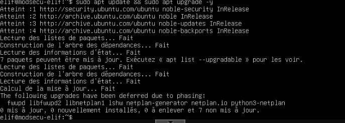

### 1.2 Déploiement et sécurisation du daemon Apache2
Le service HTTP/HTTPS constitue l'interface d'exposition principale. Son installation doit être validée et restreinte au seul périmètre nécessaire.
```bash
# Installation du service Apache
sudo apt install apache2 -y

# Validation de la version installée
apache2 -v

# Déclaration d'Apache en tant que service de démarrage persistant
sudo systemctl enable apache2

# Vérification du statut du processus daemon
sudo systemctl status apache2
```
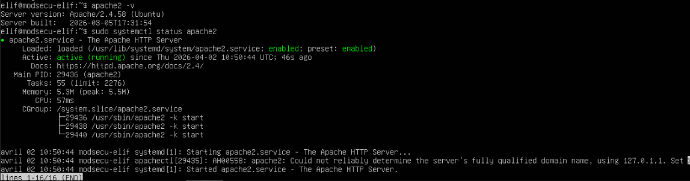
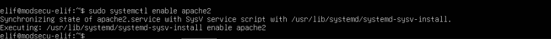

### 1.3 Paramétrage du filtrage réseau (UFW)
Conformément au principe du **moindre privilège**, les flux réseaux non nécessaires doivent être bloqués. Le pare-feu système (UFW) a été paramétré afin de sceller la zone démilitarisée (DMZ).
```bash
# Inventaire des profils applicatifs pris en charge
sudo ufw app list

# Autorisation exclusive des flux web (ports initiaux 80 et 443)
sudo ufw allow 'Apache Full'

# Allocation restreinte du protocole d'administration à distance (port 22)
sudo ufw allow 'OpenSSH'

# Activation du filtrage dynamique UFW
sudo ufw enable

# Validation de la matrice de filtrage
sudo ufw status
```
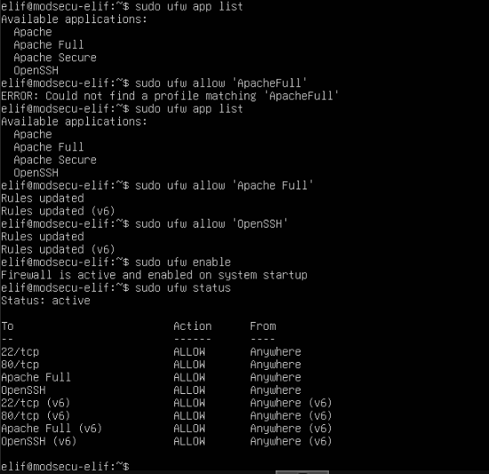

---

## ⚙️ 2. Déploiement et Configuration de ModSecurity

ModSecurity opère au niveau de la couche applicative (Niveau 7 - modèle OSI) en s'intégrant au cœur d'Apache pour scruter l'intégrité de l'ensemble des transactions HTTP.

### 2.1 Installation du module
L'import du paquet `libapache2-mod-security2` installe le moteur d'analyse, lequel requiert ensuite une initialisation.
```bash
# Téléchargement et intégration des dépendances natives
sudo apt install libapache2-mod-security2 -y

# Activation du module au sein de l'arborescence Apache
sudo a2enmod security2

# Redémarrage du serveur pour exécution des nouveaux handlers
sudo systemctl restart apache2
```
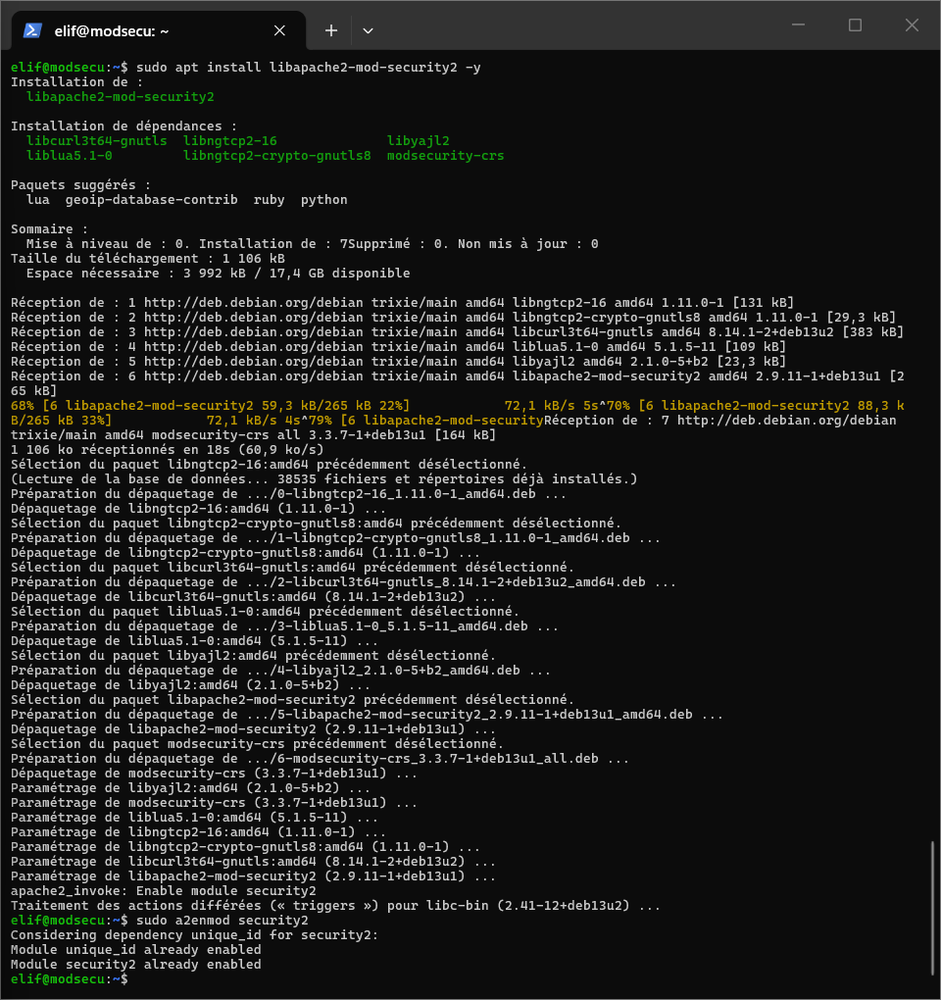

### 2.2 Audit et Configuration des directives critiques
Une configuration minimale ou inappropriée exposerait la solution à de multiples lacunes. L'architecture a donc été structurée à partir du template recommandé :
```bash
# Restructuration pour obtention d'une base de configuration opérationnelle
sudo cp /etc/modsecurity/modsecurity.conf-recommended /etc/modsecurity/modsecurity.conf
```

Dans le fichier opérationnel `/etc/modsecurity/modsecurity.conf`, une révision des paramètres suivants a été opérée :
- **`SecRuleEngine DetectionOnly`** : Positionnement en mode de pure observation (monitoring). Le trafic est analysé et journalisé de façon passive, empêchant les blocages intempestifs le temps de calibrer la solution (diminution du taux de faux positifs).
- **`SecAuditEngine On`** : Enregistrement forensique exhaustif des événements déviants.
- **`SecRequestBodyAccess On`** : Directive impérative garantissant l'analyse des corps de requêtes POST (données XML, JSON ou formulaires), vecteur majeur de l'exploitation web applicative.

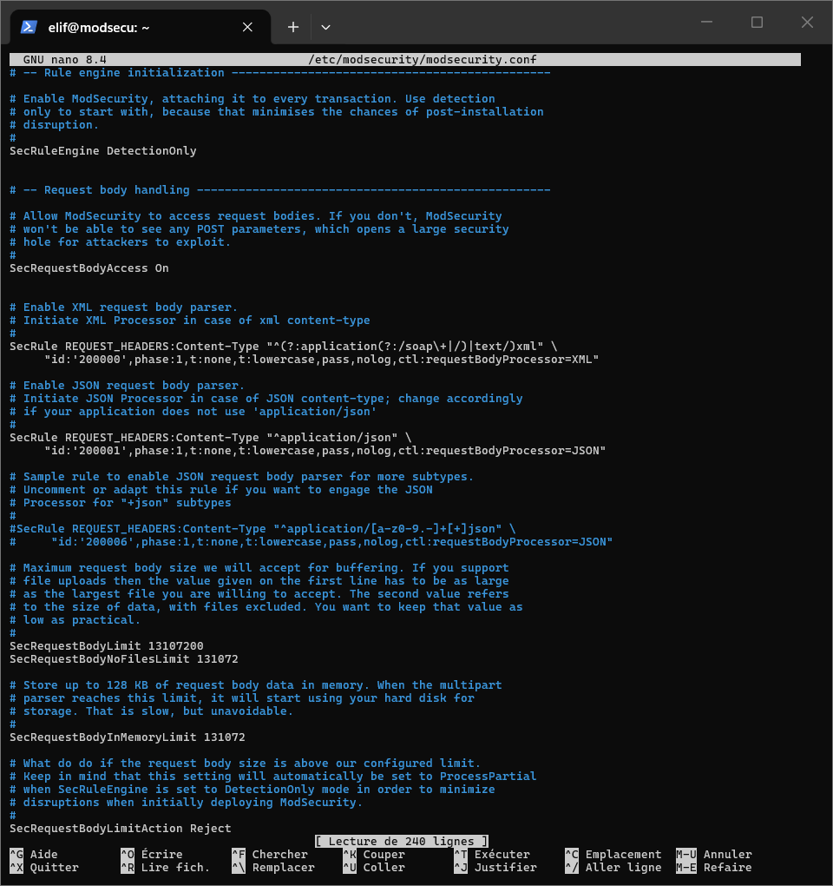

---

## 3. Déploiement Stratégique de l'OWASP Core Rule Set (CRS)

Un pare-feu WAF dépourvu de contexte est une coquille vide. L'intégration de la bibliothèque de menaces ouverte **OWASP CRS** octroie au moteur les algorithmes permettant de détecter les vecteurs d'attaque courants (OWASP Top 10).

### 3.1 Clônage des signatures de sécurité
L'intégrité du CRS est garantie par le clonage des paquets identifiés comme stables sur le référentiel github officiel.
```bash
# Fixation du tag cible 
VERSION="v4.18.0" 

# Déplacement procédural
cd /tmp

# Récupération de l'archive tarball officielle
wget "https://github.com/coreruleset/coreruleset/archive/refs/tags/${VERSION}.tar.gz"

# Dépressurisation et archivage structuré des signatures
tar -xzvf ${VERSION}.tar.gz
sudo mv coreruleset-${VERSION/v/} /etc/apache2/modsecurity-crs
```

### 3.2 Modélisation du niveau de paranoïa (Paranoia Level)
La mise en place procède par l'ajustement structurel des matrices de danger à travers le fichier de réglage natif :
```bash
cd /etc/apache2/modsecurity-crs
sudo cp crs-setup.conf.example crs-setup.conf
```

Plusieurs directives internes (`crs-setup.conf`) ont été adaptées :
1. **L'action de remédiation par défaut (`SecDefaultAction`)** : Le modèle sélectionné est l'Anomaly Scoring. Les charges suspectes sont comptabilisées ; si le cumul dépasse un seuil d'anomalie critique, le traitement logique entrainera la défaillance forcée (Code HTTP 403).
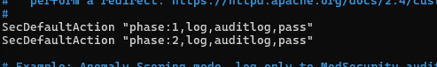
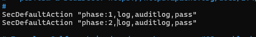

2. **Le Paranoia Level (`SecAction id:900000`)** : Fixation du profil sur `PL1`, seuil garantissant un ratio optimal entre détection d'intrusions confirmées et souplesse opérationnelle.
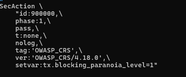

3. **Intégration d'historique de version (`SecAction id:900990`)** : Déclaration absolue de la version 4.18.0, condition requise pour l'évaluation de certains sets de règles sémantiques.
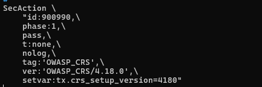

### 3.3 Inclusion des bibliothèques dans l'instance Apache
L'acheminement des requêtes vers le flux d'analyse de règles passe par la configuration spécifique du module `security2.conf` situé dans le répertoire `mods-enabled/` :
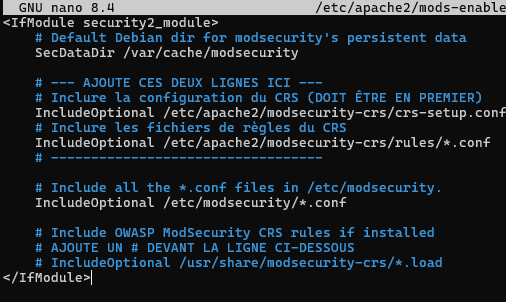

### 3.4 Tuning préliminaire et levée des limitations strictes
En environnement de test de type Proof of Concept (PoC) ne disposant pas d'un système DNS formel, l'interrogation par adresse IPv4 stricte provoque un blocage anticipé dû à la règle CRS anti-reconnaissance.

Le fichier `/etc/apache2/modsecurity-crs/rules/REQUEST-920-PROTOCOL-ENFORCEMENT.conf` a été l'objet d'une bascule conditionnelle.
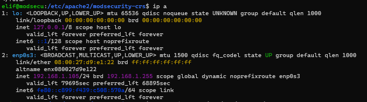
Pour la règle d'inspection `id:920350`, l'instruction `block` a muté en `pass`, de manière à assurer la continuité des tests en adresse locale IP brute.
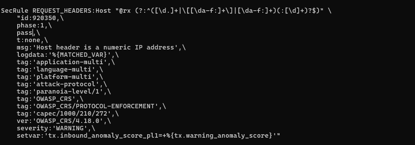

---

##  4. Contrôles Qualité et Audit d'Infrastructure

Suite à la bascule temporelle du paramètre `SecRuleEngine` sur le profil strict `On`, un banc de test opérationnel a pris lieu afin d'apprécier la capacité d'élision du WAF.

### 4.1 Diagnostic syntaxique des directives
La validation à chaud est précédée par une vérification sèche de l'ordonnancement de code :
```bash
# Vérification d'absence de corruption dans l'arborescence des paramètres
sudo apache2ctl configtest

# Ré-initialisation ordonnée face au label "Syntax OK"
sudo systemctl restart apache2
```
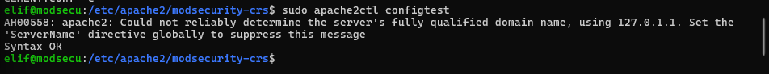

### 4.2 Injection de payloads intrusifs
L'évaluation s'est organisée à l'aide d'interactions manuelles via la commande `curl`, forgeant formellement plusieurs natures d'attaques pour valider le rempart défensif (Code 403 Forbidden escompté).

* **Test n°1 : Exfiltration et Path Traversal (CWE-22)**
  ```bash
  curl -i "http://<mon_ip>/?exec=/etc/passwd"
  ```
  Interception et interruption validées lors de la tentative de franchissement d'arborescence pour l'accès aux variables globales linux.
  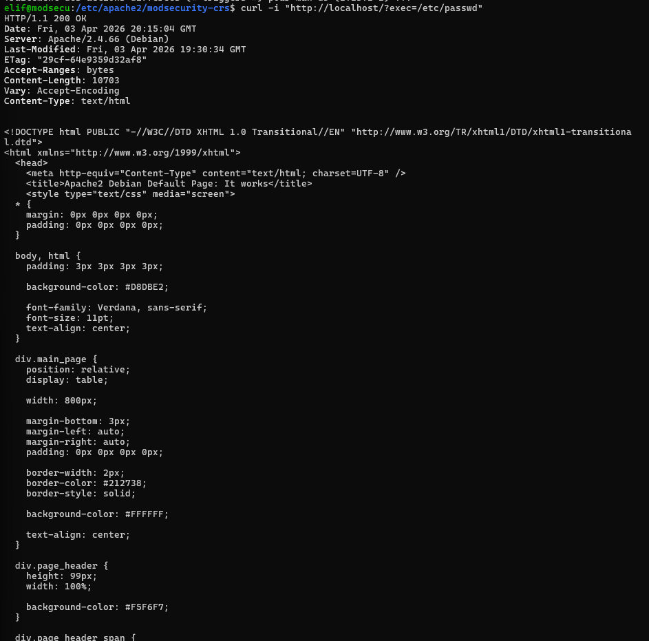

* **Test n°2 : Manipulation et Injection SQL (CWE-89)**
  Apprêtage et lancement d'un paramétrage d'url malicieux tentant l'altération de logique de base de données (Bypass type Tautologies). Le filtrage confirme la neutralisation.
  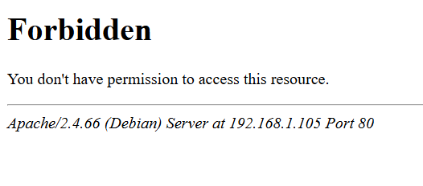

---

##  5. Supervision et Exploitation des Logs (SOC/Forensic)

La compréhension systémique et granulaire offerte par l'étude des éléments journalisés constitue un rempart essentiel aux actions de remédiations postérieures.

### 5.1 Séparation des processus de Journalisation
L'architecture sépare en deux canaux les logs WAF :
1. **L'alerte d'Incident (`error.log`)** : Formatée spécifiquement pour lever des drapeaux de signalisation auprès de SIEM externes. Ce journal intègre instantanément les ID uniques caractérisant les incidents détectés.
   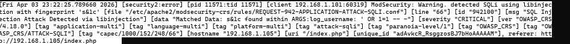

2. **L'empreinte Forensic (`modsec_audit.log`)** : Base de données détaillée restituant l'empreinte complète d'un incident isolé. Son contenu permet aux analystes d'isoler l'en-tête de contamination et la charge (payload) du tiers malveillant, exposant quelles identités de l'OWASP CRS ont déjoué la transaction.

   Représentations concrètes d'une enquête contextuelle sous audit :
   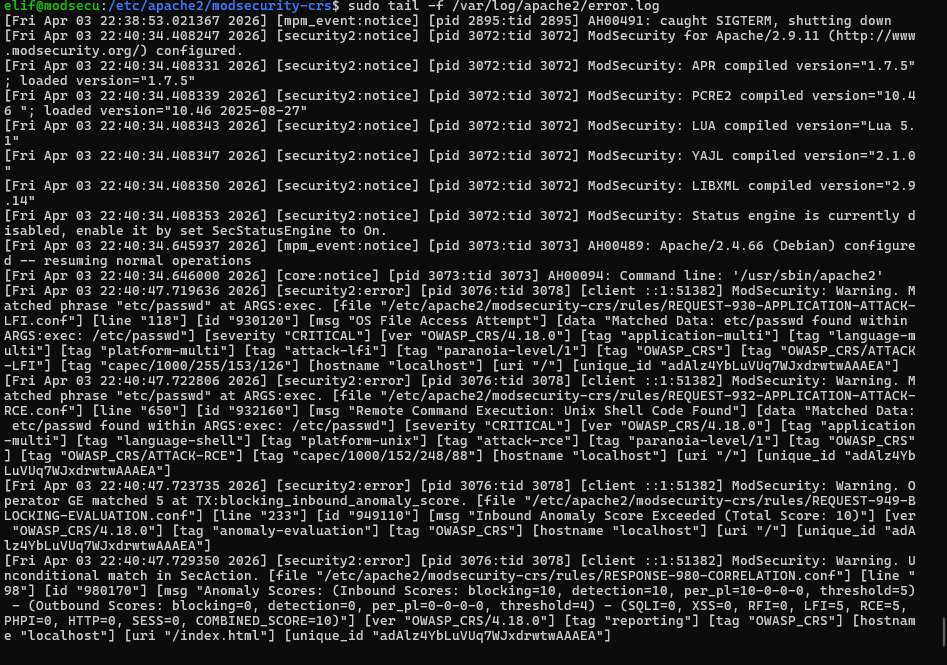
   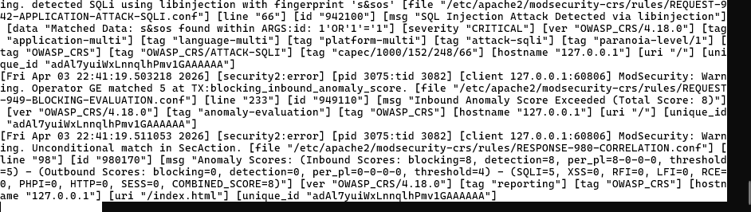
   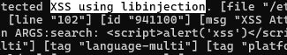
   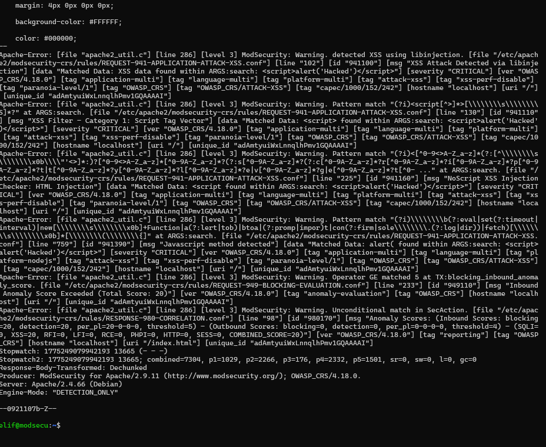
   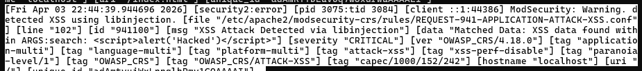

### 5.2 Calibrage par exclusion (Virtual Patching)
Dans un cadre de mise en production continue, la préservation des conditions opérationnelles et l'abolition des faux positifs sont prioritaires. Face à l'interruption présumée d'un service légitime, une exclusion ponctuelle et ciblée doit être privilégiée à l'abaissement global de la sécurité.
```bash
# Allocation du document de configuration gérant l'overriding des règles CRS
sudo touch /etc/apache2/modsecurity-crs/rules/REQUEST-900-EXCLUSION-RULES-BEFORE-CRS.conf
```
L'utilisation de la directive déclarative `SecRuleRemoveById` a permis une exception sémiotique pour calibrer rigoureusement la surface d'analyse, tout en préservant le traitement global continu.
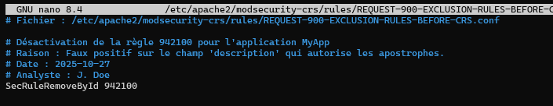

---

##  6. Déploiement Opérationnel d'un PoC : Vulnérabilités PHP/MariaDB

Dans une optique de démonstration totale des capacités défensives du déploiement ModSecurity, un squelette d'application non structuré (ne présentant aucune précaution de développement) a été instauré. 

### 6.1 Intégration matérielle de la pile logicielle
Mise sur pied d'une stack LAMP avec exécution de variables globales non sanitaires.
```bash
# Fourniture des ponts d'interconnexion pour support back-end PHP/SQL
sudo apt install mariadb-server php php-mysqli
```
L'application des règles logiques a encadré la conception d'un espace applicatif (`lab_secu_db`), limité par définition de rôle d'utilisateur confiné en base.
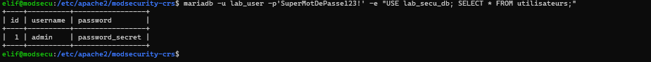

### 6.2 Démonstration de codage faillible
L'instanciation de `index.php` simule un environnement dégradé par principe : la saisie cliente subit une concaténation brute dirigée explicitement vers le parseur de la base (`mysqli_query`), provoquant structurellement une Injection SQL critique.
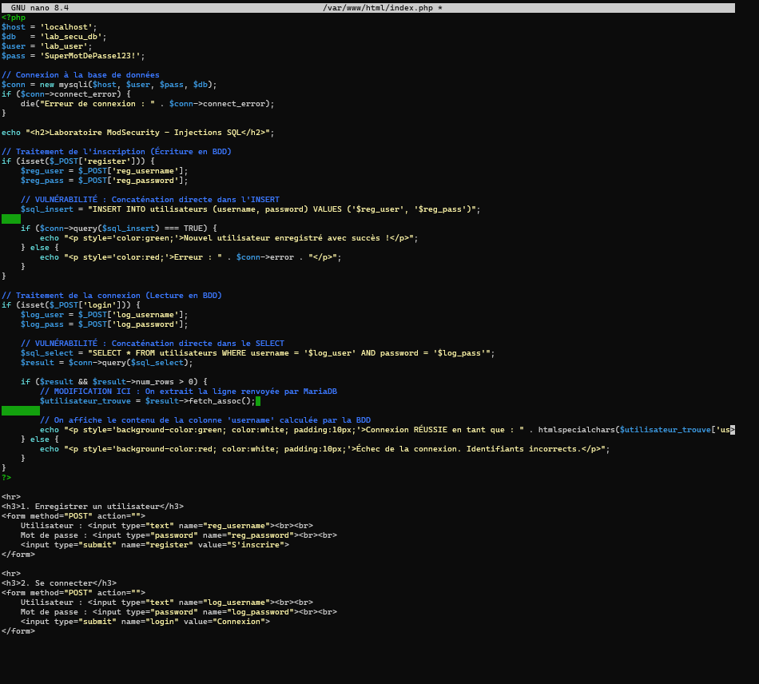
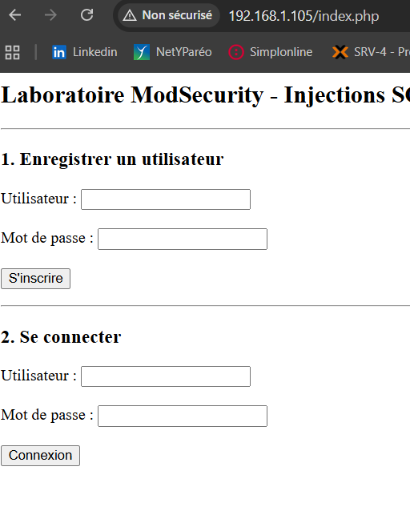

### 6.3 Exploitation des vecteurs d'attaque (WAF inactif)
Avant d'établir l'opérabilité du WAF, la faisabilité mathématique et logique de l'outil malveillant a été isolée en deux tests disctincts de Compromission de Données (Data Breach).

**Scénario 1 : Contournement Logique d'Evaluation (Authentication Bypass)**
Fourniture de la chaîne ` ' OR 1=1 -- - `  en condition `WHERE`. La tautologie force une validation "Vraie", menant à la connexion automatique sur un profil d'administration, sans disposition du mot de passe.


**Scénario 2 : Usurpation Vectorielle Structurelle (UNION Attack)**
Établissement par script d'une requête automatisée `curl` conçue pour extraire en clair des données sensibles hachées issues de tables non adressées. Le principe consiste à étendre l'affichage de valeurs factices (`1, password, 3`) corrélées à l'arborescence requise.
```bash
# Exemple de payload formaté afin de compromettre la confidentialité absolue du système ciblé
curl -s -X POST http://localhost/index.php \
     -d "log_username=personne' UNION SELECT 1, password, 3 FROM utilisateurs WHERE username='admin' #" \
     -d "log_password=nimportequoi" \
     -d "login=Connexion" | grep "Connexion RÉUSSIE"
```

La consécration de l'architecture prend effet en fermant la brèche grâce au placement de la valeur paramétrique **`SecRuleEngine On`**. Lors du test, l'OWASP CRS réagit et absorbe l'attaque (par analyse du pattern sémantique), validant instantanément les stratégies de **défense en profondeur**.
